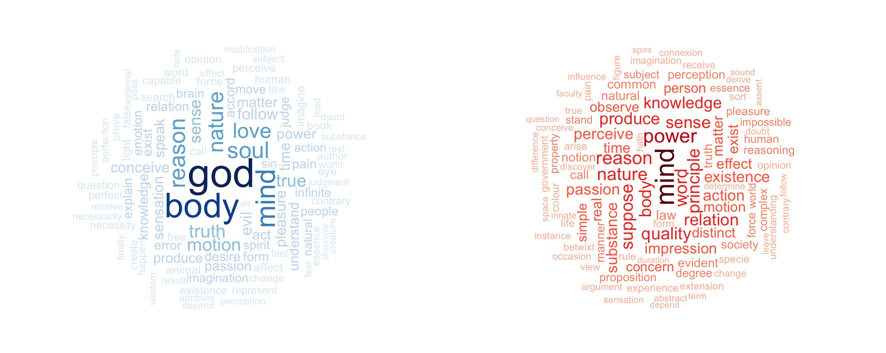

# Applied Data Science @ Columbia
## Fall 2022
## Project 1: Compare rationalism and empiricism by text mining

 

### [Introduction](doc/)
    Empiricism and rationalism are the two major schools of thought in philosophy. They both try to answer the question that how do human obtain knowledge but have distinct points of views. Here, I will use the data from https://www.kaggle.com/datasets/kouroshalizadeh/history-of-philosophy, which was compiled for the Philosophy Data Project. In this project, I will try to find and understand some evident and less obvious differences between these two schools. Specifically, I will include word frequency analysis, bi-gram analysis and sentiment analysis to explore some interesting pattern in the dataset.
This folder is orgarnized as follows.

```
proj/
├── lib/
├── data/
├── doc/
├── figs/
└── output/
```

